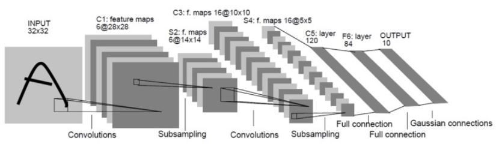

# HW4: LeNet5 with CPU and CUDA

## 0 Introduction

This is HW4 for 'Multi-core and GPU Programming 2020 Spring' at Yonsei University.

- Professor: [Jinho Lee](http://acsys.yonsei.ac.kr/)
- Teaching Assistant: [Sejong Yang](https://yangspace.co.kr/)
- Teaching Assistant: Hohyun Kim
- Student: [Jungwoo Lee](http://github.com/ljwoo94/)

## 1 Related Things

### 1-1 LeNet5 Architectures

There are two convolution layers and max-pooling layers. Then three fully connected layers are applied. You will implement these layers in CUDA version.



### 1-2 CIFAR 10

The CIFAR-10 dataset consists of 60000 32x32 colour images in 10 classes, with 6000 images per class. You will use 10000 test images to inference the class of image.


## 2 Explanation about the structure of skeleton code

```bash
user@acsys:/HW4$ tree .
.
├── build                         # objective file will be there
├── hello_cuda.cmd                # Example for running cuda on 
│                                 #     condor server
├── predict.cmd                   # Run predict on condor server
├── image                         # Images used by README.md
│   ├── cifar10_samples.PNG           # CIFAR-10 samples
│   └── LeNet5-architecture.jpg       # LeNet5-architecture
├── Makefile                      # Makefile
├── model                         # Provided pre-trained model
│   ├── conv1_index_0.txt             # activation for index 0 at test
│   ├── pool1_index_0.txt
│   ├── conv2_index_0.txt
│   ├── pool2_index_0.txt
│   ├── fc1_index_0.txt
│   ├── fc2_index_0.txt
│   ├── fc3_index_0.txt
│   ├── lenet5-cifar10-epoch_100.pth  # Pre-trained model(pickle)
│   ├── main.py                       # Used code to train
│   └── values.txt                    # model parameters you should use
│                                     #     test accuracy 72%
├── README.md                     # What you are reading :3
├── result                        # Results from condor server
├── src                           # Source Code
│   ├── common.h                      # Common
│   ├── hello.cpp                     # Example Hello World for CPU
│   ├── hello.cu                      # Example Hello World for CUDA
│   ├── LeNet5.h                      # Base LeNet5
│   ├── LeNet5.cpp
│   ├── LeNet5_cpu.h                  # CPU LeNet5
│   ├── LeNet5_cpu.cpp
│   ├── LeNet5_cuda.h                 # CUDA LeNet5
│   ├── LeNet5_cuda.cu
│   ├── main.cpp                      # main program
│   ├── util.h                        # Util
│   └── util.cpp
└── tmp                               # program will save image and 
                                      #     prediction to here

6 directories, 28 files
```
## 3 What you have todo

### Step 1: Check the data

!!!!!Don't write or update the data!!!!!

```bash
user@acsys:/HW4$ ls /nfs/data/cifar10/
batches.meta.txt  data_batch_2.bin  data_batch_4.bin  download_cifar10.sh  test_batch.bin
data_batch_1.bin  data_batch_3.bin  data_batch_5.bin  readme.html
```

### Step 2: Implement LeNet_cuda

Implement `normalize`, `conv`, `relu`, `pool`, `fc` with CUDA at `src/LeNet5_cuda.cu`.

You should use 32 bit float or 64 bit double on CUDA. In other words, you can't use 8 bit, 16 bit quantization. 
Also, `tensorcore` is not allowed on this homework.

You should NOT modify any of main.cpp.
We will give ycppou significant penalty if it is modified from the original code.
If you think some modification is necessary, please contact us.

In general, we have designed our skeleton code so that you only have to fill LeNet5_cuda.cu:predict() with your own kernels.
However, you can change the class structure at your will if you are not happy with what we've provided, as long as you don't touch main.cpp.

Check `model/main.py` to see original python code. 
Check `src/LeNet5_cpu.cpp` to see converted c++ referenced code.

### Step 3: Check the result

```bash
user@acsys:/HW4$ ls tmp/
cifar10_test_0_cat.bmp   cifar10_test_3_airplane.bmp  cifar10_test_6_airplane.bmp    cifar10_test_7_frog.bmp
cifar10_test_1_ship.bmp  cifar10_test_4_frog.bmp      cifar10_test_6_automobile.bmp  cifar10_test_8_cat.bmp
cifar10_test_2_ship.bmp  cifar10_test_5_frog.bmp      cifar10_test_7_airplane.bmp    cifar10_test_9_automobile.bmp

user@acsys:/HW4$ cat result/lenet5.out 
[INFO] Arguments will be as following: 
    INPUT_PATH: test_batch.bin
    DATA_OFFSET: 0
    BATCH: 10
    IMG_PATH_TEMPLATE: tmp/cifar10_test_%d_%s.bmp
    PARAMETER_PATH: values.txt
[INFO] Arguments will be as following: 
    INPUT_PATH: /nfs/data/cifar10/test_batch.bin
    DATA_OFFSET: 0
    BATCH: 10
    IMG_PATH_TEMPLATE: tmp/cifar10_test_%d_%s.bmp
    PARAMETER_PATH: model/values.txt
[INFO] Initialize variables
[INFO] Allocate memories
[INFO] Read image from data_offset 0 at /nfs/data/cifar10/test_batch.bin
[INFO] Save image to tmp/cifar10_test_0_cat.bmp
[INFO] Save image to tmp/cifar10_test_1_ship.bmp
[INFO] Save image to tmp/cifar10_test_2_ship.bmp
[INFO] Save image to tmp/cifar10_test_3_airplane.bmp
[INFO] Save image to tmp/cifar10_test_4_frog.bmp
[INFO] Save image to tmp/cifar10_test_5_frog.bmp
[INFO] Save image to tmp/cifar10_test_6_automobile.bmp
[INFO] Save image to tmp/cifar10_test_7_frog.bmp
[INFO] Save image to tmp/cifar10_test_8_cat.bmp
[INFO] Save image to tmp/cifar10_test_9_automobile.bmp
[INFO] CPU  elapsed time is 21.5806 msec
[INFO] CUDA elapsed time is 492.896 msec
[INFO] CUDA predict is as following:
CPU:CLASS(NUMBER,T/F),CUDA:CLASS(NUMBER,T/F),Label:CLASS(NUMBER)
CPU:        cat(3,1), CUDA:        cat(3,1), Label:        cat(3)
CPU: automobile(1,0), CUDA: automobile(1,0), Label:       ship(8)
CPU:       ship(8,1), CUDA:       ship(8,1), Label:       ship(8)
CPU:   airplane(0,1), CUDA:   airplane(0,1), Label:   airplane(0)
CPU:       frog(6,1), CUDA:       frog(6,1), Label:       frog(6)
CPU:       frog(6,1), CUDA:       frog(6,1), Label:       frog(6)
CPU:       frog(6,0), CUDA:       frog(6,0), Label: automobile(1)
CPU:       frog(6,1), CUDA:       frog(6,1), Label:       frog(6)
CPU:        cat(3,1), CUDA:        cat(3,1), Label:        cat(3)
CPU: automobile(1,1), CUDA: automobile(1,1), Label: automobile(1)

Correct

CPU error:20% GPU error:20%
```

## 4 Criteria
- You should implement the entire LeNet-5 with cuda 
- Your kernels should be functionally equivalent to the cpu version
- The trained model is supposed to give around 60% accuracy. 
We have set a huge margin of +-5% for the difference of the cuda version and the reference C++ version.
- If you fail to implement some part of the kernel in cuda, you can use the CPU version. 
However, it is your job to make sure to cudaMemcpy() so that the function still works correctly.
- No external libraries. Especially cuDNN. If you think you need something and it's not about cuda programming, contact us before doing so.
- As in HW3, we will measure the performance of batchsize=1 and batchsize=128, and use the product of the two.

#### CPU

```bash
user@acsys:/HW4$ make hello_cpu
/usr/local/cuda-10.2/bin/nvcc -I/usr/local/include/opencv4/opencv -I/usr/local/include/opencv4 -L/usr/local/lib -lopencv_dnn -lopencv_gapi -lopencv_highgui -lopencv_ml -lopencv_objdetect -lopencv_photo -lopencv_stitching -lopencv_video -lopencv_calib3d -lopencv_features2d -lopencv_flann -lopencv_videoio -lopencv_imgcodecs -lopencv_imgproc -lopencv_core -o hello_cpu src/hello.cpp 
./hello_cpu
Hello, World!
```

#### CUDA

You can reference this to implment, compile and submit(run on condor) your `LeNet5_cuda`.

```bash
user@acsys:/HW4$ make hello_cuda
/usr/local/cuda-10.2/bin/nvcc -I/usr/local/include/opencv4/opencv -I/usr/local/include/opencv4 -L/usr/local/lib -lopencv_dnn -lopencv_gapi -lopencv_highgui -lopencv_ml -lopencv_objdetect -lopencv_photo -lopencv_stitching -lopencv_video -lopencv_calib3d -lopencv_features2d -lopencv_flann -lopencv_videoio -lopencv_imgcodecs -lopencv_imgproc -lopencv_core -o hello_cuda src/hello.cu
```

```bash
user@acsys:/HW4$ make hello_run_on_server 
/usr/local/cuda-10.2/bin/nvcc -I/usr/local/include/opencv4/opencv -I/usr/local/include/opencv4 -L/usr/local/lib -lopencv_dnn -lopencv_gapi -lopencv_highgui -lopencv_ml -lopencv_objdetect -lopencv_photo -lopencv_stitching -lopencv_video -lopencv_calib3d -lopencv_features2d -lopencv_flann -lopencv_videoio -lopencv_imgcodecs -lopencv_imgproc -lopencv_core -o hello_cuda src/hello.cu 
condor_submit hello_cuda.cmd
Submitting job(s).
1 job(s) submitted to cluster 29601.
```

```bash
user@acsys:/HW4$ cat result/hello.out 
Hello World from host!
Hello World from device!
    threadIdx.x: 0
    blockIdx.x: 0
    blockDim.x: 3
Hello World from device!
    threadIdx.x: 1
    blockIdx.x: 0
    blockDim.x: 3
Hello World from device!
    threadIdx.x: 2
    blockIdx.x: 0
    blockDim.x: 3
Hello World from device!
    threadIdx.x: 0
    blockIdx.x: 1
    blockDim.x: 3
Hello World from device!
    threadIdx.x: 1
    blockIdx.x: 1
    blockDim.x: 3
Hello World from device!
    threadIdx.x: 2
    blockIdx.x: 1
    blockDim.x: 3
```

## 8 References

- Lecture Slides
- [LeCun et al, 1998, Gradient-Based Learning Applied to Document Recognition](http://yann.lecun.com/exdb/publis/pdf/lecun-01a.pdf)
- [CIFAR-10 dataset](https://www.cs.toronto.edu/~kriz/cifar.html)
- [Neural Network Tutorials - Pytorch](https://pytorch.org/tutorials/beginner/blitz/neural_networks_tutorial.html)
